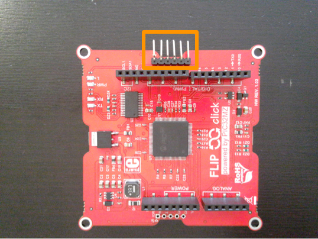
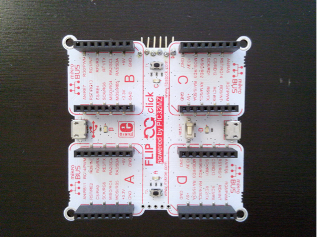
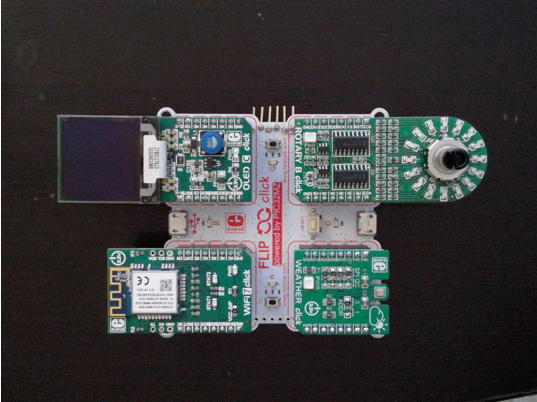
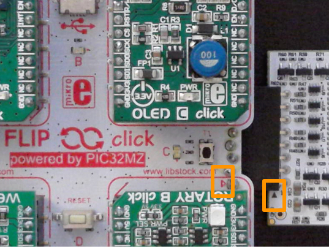
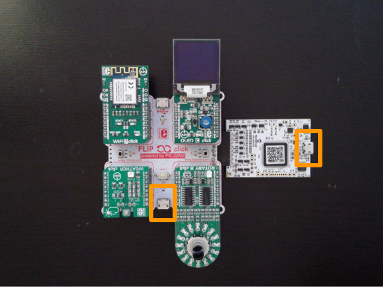

# Lab 1: Setup the Environment

In this lab you will prepare the hardware, download the workshop content locally, and initilize the cloud components.  We will also login to your Amazon Web Services account to configure credentials for the hardware used in this workshop and to have interface for tracking the device telemetry data and device shadow.

## Applying your Credits

If as part of this workshop you received credits to offset any potential cost occurred in the AWS Cloud during this workshop, please follow the steps on the card provided to apply the credits.

## Software Setup

The workshop requires you have the following software installed:

- Microchip MPLAB X IDE v5.15 or higher
- Microchip MPLAB XC32 v2.15 or higher
- Microchip MPLAB Harmony v2.06 or higher
- GNU operating environment, with (minimally):
	- GNU Coreutils
	- GNU Shellutils
	- GNU Fileutils
	- Git
- AWS Command Line Interface (CLI) (Python 3 / Boto)

### Microchip MPLAB X IDE

Use the following instructions.

1. Open browser.
2. Navigate to the [MPLAB X IDE](https://www.microchip.com/mplab/mplab-x-ide) page.
3. Scroll close to the bottom of the page, and click on the Downloads tab.
4. Download the latest MPLAB X IDE for your target platform.
5. Install with default options to your workstation.

### Microchip MPLAB Harmony

Use the following instructions.

1. Open browser.
2. Navigate to the [MPLAB Harmony](https://www.microchip.com/mplab/mplab-harmony) page.
3. Scroll down until you see the Downloads tab and click it.
4. Locate the latest MPLAB Harmony 2.x for your target platform.
5. Install with default options to your workstation.

### GNU Operating Environment

Microchip supports MPLAB X on the Windows, Mac OSX, and Linux operating systems.  Both Mac OSX and Linux natively install the GNU stack.  On Windows, a GNU stack must be involved.  If you are currently not running a modern version of Cygwin or MSYS, we recommend installing Git Bash via [Git for Windows](https://gitforwindows.org/, which also has Python 3 pre-installed.

### Python 3 and AWS CLI

Python 3.x (modern: 3.7.x) is required to install the AWS CLI.

#### Linux

If Python 3 is not already installed, do so:

```bash
sudo apt-get update
sudo apt install software-properties-common
sudo add-apt-repository ppa:deadsnakes/ppa
sudo apt-get install python3.7
sudo apt-get install python3-pip
pip3 install --user awscli
```

#### Mac OSX

Unless downloaded from the python website, the easiest way to install Python 3.7 is through ```brew```.  If you do not have ```brew``` installed, do the following.


Open a terminal window and perform the following to install Python 3.

```bash

```

Your Mac OSX may still uses Python 2.x by default, and your freshly brewed Python 3.7 is in ```/usr/local/bin```.

```bash
/usr/local/bin/python --version
Python 2.7.16
/usr/local/bin/python3.7 --version
Python 3.7.3
```

Ensure that your .bash_profile or local terminal session is fixed properly to include 


## Hardware Setup

Unless the hardware is still new in box, it will be pre-configured for you prior to the start of the workshop.  This section outlines the steps to configuring the physical aspects such that you can quickly check your hardware.

The Mikroelekronika Flip N Click has one serial connection to your workstation and an ICSP header that is used to connect to a Microchip debugger such as an MPLAB SNAP or ICD4.

First, ensure you have all components available to you.

- 1 [MIKROE-2340](https://www.mikroe.com/flipclick-pic32mz) Flip&Click PIC32MZ
- 1 [MIKROE-1585](https://www.mikroe.com/oled-c-click)	OLED C click	$29	User interface
- 1 [MIKROE-2046](https://www.mikroe.com/wifi-7-click)	WiFi 7 click	$29	Wireless connectivity
- 1 [MIKROE-1978](https://www.mikroe.com/weather-click)	Weather click	$22	Temperature and Humidity
- 1 [MIKROE-2380](https://www.mikroe.com/rotary-o-click)	Rotary O Click	$12	Analog dial control
- 1 [MPLAB SNAP](https://www.microchip.com/developmenttools/ProductDetails/PartNO/PG164100). To use this, you need to solder the ICSP header to the Flip N Click.
- 2 USB Micro B cables 

Build the components.

1. Unbox components.
2. If not done already, solder pins to the ICSP header location.
	
   
	
   Flip over the board.
   
   

3. To mikroBUS location A, insert the WIFI 7 Click.
4. To mikroBUS location B, insert the OLED C Click.
5. To mikroBUS location C, insert the Rotary B Click.
6. To mikroBUS location D, insert the Weather Click.
7. After all clicks have been input, the result should look like the following.

   

8. Insert the MPLAB SNAP to the ICSP header pins so that PIN 0 has alignment.  Note the small arrows on each board.

   

The result should look similar to the following.  The orange boxes outline where the USB cables should be connected.  You will be using the connection to the main board for power up and serial output.  You will be using the connection to the SNAP debugger for programming and debugging.



Connect the two USB cables between the board and your workstation.

### Serial Port Installation and Connection: Windows

Ensure you have a serial port terminal emulator such as [Putty](//www.chiark.greenend.org.uk/~sgtatham/putty/latest.html) or [Tera Term](https://osdn.net/projects/ttssh2/releases/) installed.

1. Open Device Manager.  View the current COM ports available.
2. Plug in the Flip N Click device.
3. Identify the change in COM ports.
4. Use Putty, Tera Term, or your other favorite serial program to connect to the COM port at 115200-N-1.

### Serial Port Installation and Connection: MacOS/Linux

Virtually all Linux distributions have ```screen``` installed and MacOS has ```screen``` installed by default.

1. Open a [Terminal](https://en.wikipedia.org/wiki/Terminal_(macOS)) window on MacOS or an XTerm (or your favorite terminal program) on Linux.
2. Issue the following command to view current serial devices.

   ```bash
   ls /dev/cu.usb*
   ```
3. Plug in the Flip N Click device.
4. Issue the following command again to identify the device.

   ```bash
   ls /dev/cu.usb*
   ```
5. Identify the change of items in the list, and issue the following command:

   ```bash
   screen /dev/<device> 115200 -L
   ```

   For example, if the difference was ```cu.usbmodem0003```, the command would be:

   ```bash
   screen /dev/cu.usbmodem0003 115200 -L
   ```

Alternatively, if you use MacOS, the application [Serial](https://www.decisivetactics.com/products/serial/) is a great choice.  It is not free, but has many usability features that are common to applications running on MacOS.


## AWS Cloud Setup


### Prerequisites

A general familiarity with Linux command line operation under the bash shell is assumed.

The labs require that you have Git and the AWS Command Line Interface (CLI) installed to perform functions in the AWS Cloud. 

The following scripts will succeed if your IAM user has the *```AdministratorAccess```* policy attached with no permission boundaries.
This is very broad, and narrower options might succeed, but have not been tested.

### Clone Workshop Repository

In this section, you will clone the workshop Git repository.  The Git repository contains all the workshop code and scripts you will use.

1. If not already done, open a terminal windows that hosts the GNU shell environment.
2. Ensure you are in the $HOME directory

   ```bash
   cd $HOME
   ```
3. Clone the repository by running the following command.

   ```bash
   git clone --recursive https://github.com/rpcme/aws-mikroe-smarthome-pic32mz
   cd aws-mikroe-smarthome-pic32mz
   ```
   
   The total repository size is more than 30MB so it may take some time to download. Please be patient.
   
You're done! Let's move to the next section.

### AWS IoT Console Sign In

In this section you will log-in to the AWS IoT Console if you have not already done so.  Leave this interface open for the remainder of the lab as it is used for monitoring and testing the target board.

Go to [AWS Console Sign In](https://aws.amazon.com/) page and click on the "Sign In" box in the upper right.  Log in with your AWS credentials and then browse to the IoT Core page.  We will use the services provided under IoT Core in the next few labs.

### Configure AWS Command Line Interface (CLI)

In this section, we will configure the AWS CLI in your shell environment.  The AWS CLI provides the mechanisms for driving AWS IoT Console cloud actions. For more information or details on configuration, visit the [Configuring the AWS CLI](https://docs.aws.amazon.com/cli/latest/userguide/cli-chap-getting-started.html) page and follow steps 1-5 to add the *```AdministratorAccess```* policy to your username and capture the Key ID and Secret Access Key as you will need them in the steps below.

The AWS CLI has already been installed in a previous section.

Start the configuration as follows:
```bash
aws configure
```
This step will ask for the following pieces of information:

1. Type or copy-paste your AWS Access Key ID acquired above and press ```Enter```.
2. Type or copy-paste AWS Secret Access Key acquired above and press ```Enter```.
3. Default region name - use ```us-west-2``` (or other region having AWS IoT Core)
4. Default output format - use ```json```

Note that the first two will be stored unencrypted in the file ```~/.aws/credentials```, the rest will be stored in ```~/.aws/config```. For your security, delete the credentials file at the end of the workshop.

## Outcomes
In this lab, you installed prerequisites to your workstation and installed lab prerequisites to the AWS Cloud in your account.

[Next Lab](./Section2.md)

[Index](./README.md)

Copyright (C) 2019 Amazon.com, Inc.  All Rights Reserved.
